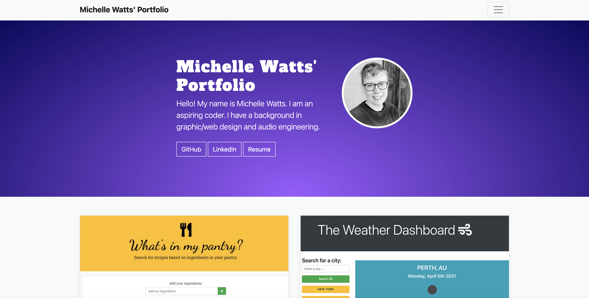

# Michelle Watts' Portfolio

## Links
### Link to deployed app is [here](https://michellewatts20000.github.io/watts-portfolio-2.0/)
### Link to the GitHub repo is [here](https://github.com/michellewatts20000/watts-portfolio-2.0/)

## Technologies used
HTML, CSS, Bootstrap, FontAwesome.

## What?
Shows all the projects I have worked on over the last 6 months.

## Screenshots

## Contact
Michelle Watts
watts.e.michelle@gmail.com